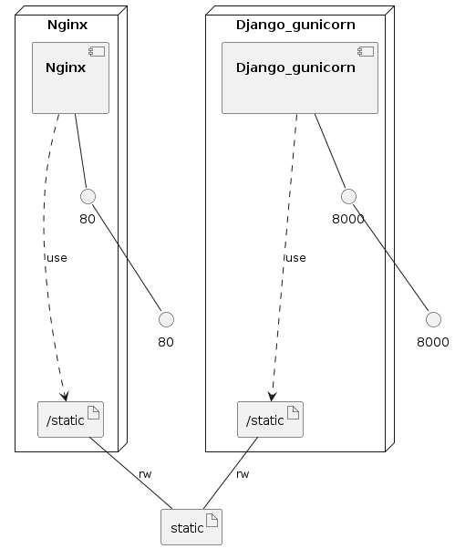

# Run Django with Docker Compose

This repo contains code to spin up a boilerplate Django project with Docker Compose.

It will be hosted locally using Gunicorn and Nginx containers.

# Usage

Run services in the background:
`docker-compose up -d`

Run services in the foreground:
`docker-compose up --build`

Inspect volume:
`docker volume ls`
and
`docker volume inspect <volume name>`

Prune unused volumes:
`docker volume prune`

View networks:
`docker network ls`

Bring services down:
`docker-compose down`

Open a bash session in a running container:
`docker exec -it <container ID> /bin/bash`

# Flow

1. The docker-compose yaml file will first spin up the Gunicorn container that will run the Django project at port 8000

2. The entrypoint to the *django_gunicorn* service is *entrypoint.sh*. This script will do a database migration and it will also collect the static files used by the Django project.

3. The static files will be collected in *STATIC_ROOT*. This is the */static* directory in the container.

4. This directory is mounted to a Docker volume on the local machine.

5. The next container that will be spun is Nginx. The Dockerfile for this container is in the */nginx* folder. The Nginx configuration will interact with the Gunicorn service at port 8000 and it will also serve the static files in */static* also mounted to the same volume.

# Endpoints

* You will be able to reach the Django project at 0.0.0.0:80. This is the Nginx endpoint that interacts with Gunicorn at 0.0.0.0:8000

* To validate that the static files are being served correctly, you can visit 0.0.0.0:80/admin. This endpoint will show you the admin page with the correct style used.
Gunicorn does not serve static files, so if you visit 0.0.0.0:8000/admin - the admin page will pop up without the default style.

### Infrastructure model

